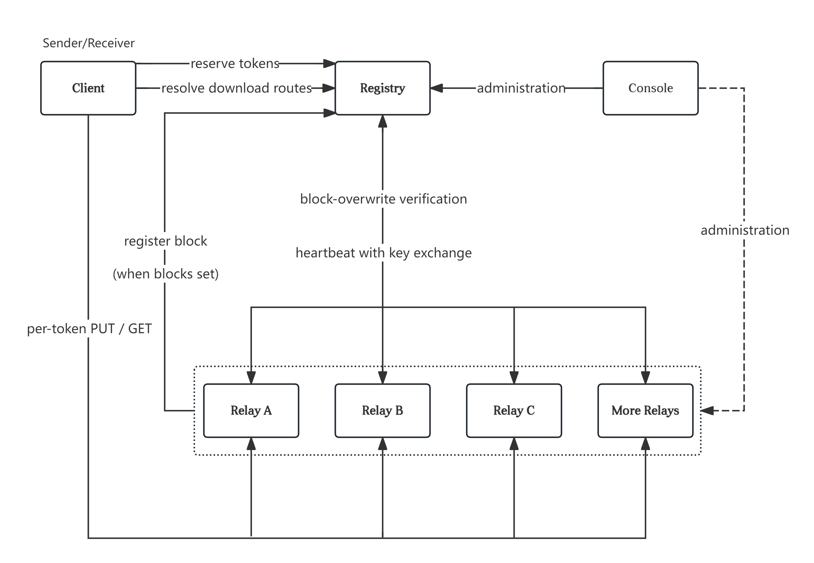

# 12C STATELESS RELAY TRANSFER

This is a file transfer system based on the 12C protocol that keeps relay storage stateless and metadata indistinguishable on the server. Extraction rights are carried by a 12-character out-of-band credential that both indexes the data and protects confidentiality.

Local setup: [`HOW_TO_SETUP.md`](HOW_TO_SETUP.md).

---

## Protocol

12C encodes a file into opaque wire blocks addressed by deterministic **Tokens**, plus a fixed-size encrypted **SMB** (super metadata block). Peers exchange Tokens and a **12-character credential** out of band; servers store blind blobs only.

Payload encryption has two wire-compatible modes:

- **V2** — single GCM over the full padded plaintext (`segment_code = 0`)
- **V2.1** — independent GCM per segment (`segment_code ≥ 1`)

Wire format, cryptography, SMB layout, Merkle tree, and sender/receiver rules are specified in:

- [Protocol (English)](docs/12C-Transfer-Protocol.en.md)
- [Protocol (中文)](docs/12C-Transfer-Protocol.zh.md)

Implementation map (C++ / WASM): [`client/core/README.md`](client/core/README.md).

---

## System

Registry handles routing and scheduling; Relays hold opaque blocks; the Client owns crypto and session orchestration; Console is the ops surface.

### Architecture

#### Components

| Component | Path                 | Role                                                                                  |
| --------- | -------------------- | ------------------------------------------------------------------------------------- |
| Client    | `client/`          | WASM crypto + TypeScript sessions; Web UI                                             |
| Registry  | `server/registry/` | Token reservation, placement, heartbeats, overwrite auth; serves Client static assets |
| Relay     | `server/relay/`    | Disk blob store + SQLite index; registers/heartbeats with Registry                    |
| Console   | `server/console/`  | Ops UI (process control, allowlist, DB browse)                                        |

#### Topology

One Registry (control plane) plus a pool of Relays (data plane). The **Client** calls Registry for **reserve** and **resolve**, then PUT/GET blocks on assigned Relays. After a successful PUT, the **Relay** calls Registry **register** (and **verify-overwrite** when needed). Console manages the pool; Relays stay online via heartbeat.



| Registry call        | Caller                                     |
| -------------------- | ------------------------------------------ |
| `reserve-tokens`   | **Client** (before upload)           |
| `resolve`          | **Client** (before download)         |
| `register`         | **Relay** (after local PUT succeeds) |
| `verify-overwrite` | **Relay** (on conflicting PUT)       |
| `heartbeat`        | **Relay** (ongoing)                  |

Upload places Tokens across a **primary stripe** of width `S` (token `i` → primary `i % S`) and optional **replicas** from a separate pool sized by file-level factor `R`. Download `resolve` returns per-token targets ordered by load so the Client can failover across holders.

A single-Relay deploy is the degenerate case (`S = 1`, `R = 0`). Dev UI may use Vite (`:5173`) while Registry serves the production `client/web/dist/` bundle.

#### Layering

- **Server:** `api` → `services` / `domain` → `persistence` (plus `crypto`, `scheduling`, Registry client)
- **Client:** protocol docs → C++ crypto → WASM bindings → TS session / app policy → Web UI

#### Trust and keys

- `registryApiKey` — Relay ↔ Registry auth and use-count rotation
- `blockAuthMasterKey` / `blockAuthKey` — HMAC authorization for overwrites
- Relay RSA public key — receive next encrypted key material
- `adminApiKey` — Console / Admin API

#### Data flow

- **Upload:** Client encode → Client `reserve-tokens` → Client PUT to Relay → Relay `register` (Relay `verify-overwrite` if needed)
- **Download:** Client credential → Client `resolve` → Client GET from Relay → Client decrypt and verify
- **Replica abandon:** `abandon-replica-placements` removes replicas only (primary kept)

#### Storage lifecycle

- Relay: blobs + SQLite; local `blockMaxAge` is independent of Registry token TTL
- Registry: tokens, placements, allowlist, heartbeat state — see [`docs/数据库设计说明.md`](docs/数据库设计说明.md)

Per-service detail: [`server/README.md`](server/README.md), [`server/registry/README.md`](server/registry/README.md), [`server/relay/README.md`](server/relay/README.md).

### Strategy

Knobs live mainly in Registry `placementPolicy` and service configs. Algorithms: `server/registry/registry_server/scheduling/`.

#### Placement (stripe and replica)

- Prefer healthy Relays with lower `storage_rate`
- Choose stripe width `S` and file-level replica factor `R`
- Assign each Token a primary and optional replicas

#### TTL grant and degrade

- Clip client-requested TTL to policy bounds
- Filter Relays by effective cap from `blockMaxAge` (clock skew applied)
- If capacity is short, degrade TTL and/or shrink topology

#### Read steering

- Order holders of one Token by ascending `storage_rate`; tie-break primary first
- Client uses the first target as preferred GET, others as failover

#### Overwrite and sweep

- Duplicate PUT: `verify-overwrite` + blockAuth MAC + `expiryAt`
- Relay periodic sweep of expired rows and orphan blobs

#### Client segment policy

- App-layer default `segment_code` by file size (crypto layer does not auto-select)
- Streaming prepare path for large files — see [`client/core/README.md`](client/core/README.md)

#### Heartbeat and pool admission

- Allowlist approve / enable / disable
- `heartbeatUrlPolicy`: `sync_if_unset` or `strict`
- Optional `autoRegisterOnStartup` vs Console manual registration

---

## Repository

| Path                                  | Contents                     |
| ------------------------------------- | ---------------------------- |
| [`docs/`](docs/)                     | Protocol specs, DB design    |
| [`client/`](client/)                 | Browser client and WASM core |
| [`server/`](server/)                 | Registry, Relay, Console     |
| [`HOW_TO_SETUP.md`](HOW_TO_SETUP.md) | End-to-end local setup       |

## Quick start

Minimum path:

* **Console** + **Registry** + **Relay**;
* Admit the Relay to the pool of Registry;
* Then open the **Client** on Registry.

### 1. Start the servers

**Python 3.10+** and **Node.js 18+** are required. On Windows:

```powershell
cd server
.\start-all.ps1
```

This opens Registry and Relay in new windows and keeps Console in the current one. Prefer managing **Registry** / **Relay** from the Console sidebar (start / stop) instead of driving those processes by hand. You can also start only Console (`cd server\console` → `.\start.ps1`) and launch Registry / Relay from the UI.

Open **Console**: [http://127.0.0.1:8070](http://127.0.0.1:8070)

| Service  | Default URL                          |
| -------- | ------------------------------------ |
| Console  | http://127.0.0.1:8070                |
| Registry | http://127.0.0.1:8080 (+ Client Web) |
| Relay    | http://127.0.0.1:9090                |

Linux / macOS: use each directory’s `start.sh`, or `server/start-all.sh` if present.

### 2. Admit the Relay (first run)

Relays are not in the pool until approved:

1. In Console, open the **Relay** panel and confirm it is online.
2. Click **Register with Registry** (URL `http://127.0.0.1:8080`, or use “fill local Registry”).
3. Switch to the **Registry** panel → envelope (registration inbox) → **Approve and assign**.

The Relay card should show **online**. Skip this if it is already on the allowlist.

### 3. Build and open the Client

```powershell
cd client

# --- First machine: install emsdk (+ write user EMSDK), then production bundle ---
.\build.ps1 -SetupEmsdk -EmsdkRoot C:\path\to\emsdk -Production

# --- EMSDK already set ($env:EMSDK or prior -SetupEmsdk): omit -EmsdkRoot ---
.\build.ps1 -Production

# --- Only TypeScript / UI changed (reuse existing WASM) ---
.\build.ps1 -Production -SkipWasm

# --- Only C++ / WASM bindings changed ---
.\build.ps1 -Production -SkipTs -ForceWasm

# --- Force rebuild TS + WASM + production bundle ---
.\build.ps1 -Production -ForceWasm
```

First-time WASM builds need Emscripten (`.\build.ps1 -SetupEmsdk -EmsdkRoot <emsdk-path> -Production`). Restart Registry after a production build, then open: **http://127.0.0.1:8080**

For frontend hot reload of **Client**, use Vite (`.\start.ps1` → `:5173`) instead; see [`client/README.md`](client/README.md).

Full walkthrough (tunnels, troubleshooting): [`HOW_TO_SETUP.md`](HOW_TO_SETUP.md).

---

Contact us at https://github.com/Bamder/12c-stateless-relay-transfer
